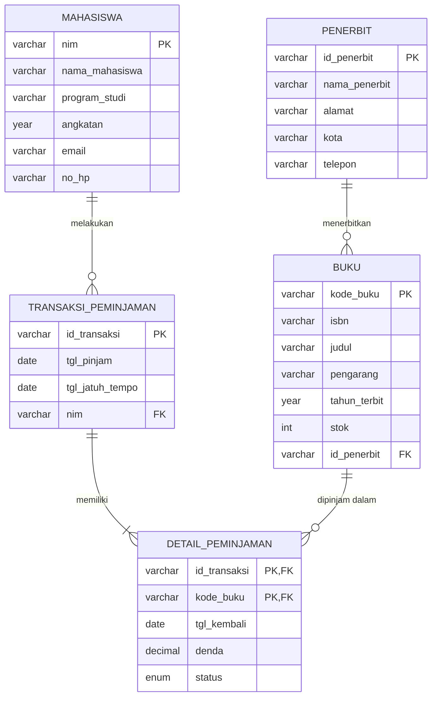

# Tugas Mandiri: Perancangan ERD E-Library Kampus

| | |
|---|---|
| **Nama** | Muh Fauzan Dwi Riyan |
| **NIM** | D121241051 |
| **Modul** | 06 – Pemodelan Database |

---

## 1. Deskripsi Singkat

Sistem E-Library Kampus dipakai untuk mencatat data mahasiswa, koleksi buku, penerbit, serta riwayat peminjaman dan pengembalian buku. Satu mahasiswa bisa meminjam banyak kali, satu transaksi bisa berisi lebih dari satu buku, dan satu penerbit bisa menerbitkan banyak buku.

Asumsi yang dipakai:

1. Satu transaksi peminjaman bisa memuat beberapa buku (maksimal ditentukan aturan perpustakaan).
2. Pengembalian dicatat per buku, karena buku dalam satu transaksi bisa dikembalikan di hari yang berbeda.
3. Satu buku (judul) diterbitkan oleh tepat satu penerbit.
4. Denda dihitung per buku yang terlambat dikembalikan.

---

## 2. Identifikasi Entitas dan Atribut

### 2.1 Mahasiswa
| Atribut | Keterangan | Kunci |
|---|---|---|
| nim | Nomor induk mahasiswa | **PK** |
| nama_mahasiswa | Nama lengkap | |
| program_studi | Program studi | |
| angkatan | Tahun masuk | |
| email | Email mahasiswa | |
| no_hp | Nomor telepon | |

### 2.2 Penerbit
| Atribut | Keterangan | Kunci |
|---|---|---|
| id_penerbit | Kode penerbit | **PK** |
| nama_penerbit | Nama penerbit | |
| alamat | Alamat penerbit | |
| kota | Kota penerbit | |
| telepon | Nomor telepon penerbit | |

### 2.3 Buku
| Atribut | Keterangan | Kunci |
|---|---|---|
| kode_buku | Kode unik buku di perpustakaan | **PK** |
| isbn | ISBN buku | |
| judul | Judul buku | |
| pengarang | Nama pengarang | |
| tahun_terbit | Tahun terbit | |
| stok | Jumlah eksemplar tersedia | |
| id_penerbit | Penerbit buku | **FK** → Penerbit |

### 2.4 Transaksi Peminjaman
| Atribut | Keterangan | Kunci |
|---|---|---|
| id_transaksi | Nomor transaksi | **PK** |
| tgl_pinjam | Tanggal peminjaman | |
| tgl_jatuh_tempo | Batas tanggal pengembalian | |
| nim | Mahasiswa yang meminjam | **FK** → Mahasiswa |

### 2.5 Detail Peminjaman (tabel hasil normalisasi)
Tabel ini muncul dari relasi **many-to-many** antara Transaksi dan Buku (satu transaksi bisa banyak buku, satu buku bisa dipinjam di banyak transaksi).

| Atribut | Keterangan | Kunci |
|---|---|---|
| id_transaksi | Nomor transaksi | **PK, FK** → Transaksi Peminjaman |
| kode_buku | Buku yang dipinjam | **PK, FK** → Buku |
| tgl_kembali | Tanggal buku dikembalikan (NULL jika belum) | |
| denda | Denda keterlambatan | |
| status | Dipinjam / Dikembalikan / Terlambat | |

---

## 3. Simulasi Normalisasi

### 3.1 UNF (Unnormalized Form)

Semua data masih ditumpuk dalam satu tabel, dan satu transaksi punya beberapa buku dalam satu baris (repeating group).

| id_transaksi | tgl_pinjam | tgl_jatuh_tempo | nim | nama_mahasiswa | program_studi | no_hp | kode_buku | judul | pengarang | tahun_terbit | id_penerbit | nama_penerbit | kota_penerbit | tgl_kembali | denda |
|---|---|---|---|---|---|---|---|---|---|---|---|---|---|---|---|
| TRX001 | 2026-09-01 | 2026-09-08 | D121241001 | Andi | Teknik Informatika | 0811111 | B001, B002 | Basis Data, Algoritma | Silberschatz, Cormen | 2019, 2022 | P01, P02 | Erlangga, MIT Press | Jakarta, Cambridge | 2026-09-07, 2026-09-10 | 0, 6000 |
| TRX002 | 2026-09-02 | 2026-09-09 | D121241002 | Sari | Sistem Informasi | 0822222 | B001 | Basis Data | Silberschatz | 2019 | P01 | Erlangga | Jakarta | 2026-09-08 | 0 |
| TRX003 | 2026-09-03 | 2026-09-10 | D121241001 | Andi | Teknik Informatika | 0811111 | B003 | Rekayasa Perangkat Lunak | Sommerville | 2021 | P02 | MIT Press | Cambridge | NULL | 0 |

**Masalah:** kolom `kode_buku`, `judul`, `pengarang`, `tahun_terbit`, `id_penerbit`, `nama_penerbit`, `kota_penerbit`, `tgl_kembali`, dan `denda` berisi lebih dari satu nilai dalam satu sel, jadi belum atomik.

### 3.2 1NF (First Normal Form)

Syarat 1NF: setiap sel hanya berisi satu nilai (atomik) dan tidak ada repeating group. Solusinya, pecah baris sehingga **satu baris = satu buku dalam satu transaksi**.

**Primary Key gabungan:** (`id_transaksi`, `kode_buku`)

| id_transaksi | kode_buku | tgl_pinjam | tgl_jatuh_tempo | nim | nama_mahasiswa | program_studi | no_hp | judul | pengarang | tahun_terbit | id_penerbit | nama_penerbit | kota_penerbit | tgl_kembali | denda |
|---|---|---|---|---|---|---|---|---|---|---|---|---|---|---|---|
| TRX001 | B001 | 2026-09-01 | 2026-09-08 | D121241001 | Andi | Teknik Informatika | 0811111 | Basis Data | Silberschatz | 2019 | P01 | Erlangga | Jakarta | 2026-09-07 | 0 |
| TRX001 | B002 | 2026-09-01 | 2026-09-08 | D121241001 | Andi | Teknik Informatika | 0811111 | Algoritma | Cormen | 2022 | P02 | MIT Press | Cambridge | 2026-09-10 | 6000 |
| TRX002 | B001 | 2026-09-02 | 2026-09-09 | D121241002 | Sari | Sistem Informasi | 0822222 | Basis Data | Silberschatz | 2019 | P01 | Erlangga | Jakarta | 2026-09-08 | 0 |
| TRX003 | B003 | 2026-09-03 | 2026-09-10 | D121241001 | Andi | Teknik Informatika | 0811111 | Rekayasa Perangkat Lunak | Sommerville | 2021 | P02 | MIT Press | Cambridge | NULL | 0 |

**Masalah yang tersisa:** data redundan (data Andi, data buku, dan data penerbit berulang) dan ada ketergantungan parsial terhadap sebagian PK.

### 3.3 2NF (Second Normal Form)

Syarat 2NF: sudah 1NF dan **tidak ada ketergantungan parsial**, artinya atribut non-kunci harus bergantung pada **seluruh** PK gabungan.

Analisis ketergantungan fungsional:

- `id_transaksi` → `tgl_pinjam`, `tgl_jatuh_tempo`, `nim`, `nama_mahasiswa`, `program_studi`, `no_hp` (bergantung sebagian pada PK)
- `kode_buku` → `judul`, `pengarang`, `tahun_terbit`, `id_penerbit`, `nama_penerbit`, `kota_penerbit` (bergantung sebagian pada PK)
- (`id_transaksi`, `kode_buku`) → `tgl_kembali`, `denda` (bergantung penuh pada PK)

Hasil dekomposisi menjadi 3 tabel:

**Tabel Transaksi** (PK: `id_transaksi`)

| id_transaksi | tgl_pinjam | tgl_jatuh_tempo | nim | nama_mahasiswa | program_studi | no_hp |
|---|---|---|---|---|---|---|
| TRX001 | 2026-09-01 | 2026-09-08 | D121241001 | Andi | Teknik Informatika | 0811111 |
| TRX002 | 2026-09-02 | 2026-09-09 | D121241002 | Sari | Sistem Informasi | 0822222 |
| TRX003 | 2026-09-03 | 2026-09-10 | D121241001 | Andi | Teknik Informatika | 0811111 |

**Tabel Buku** (PK: `kode_buku`)

| kode_buku | judul | pengarang | tahun_terbit | id_penerbit | nama_penerbit | kota_penerbit |
|---|---|---|---|---|---|---|
| B001 | Basis Data | Silberschatz | 2019 | P01 | Erlangga | Jakarta |
| B002 | Algoritma | Cormen | 2022 | P02 | MIT Press | Cambridge |
| B003 | Rekayasa Perangkat Lunak | Sommerville | 2021 | P02 | MIT Press | Cambridge |

**Tabel Detail Peminjaman** (PK: `id_transaksi` + `kode_buku`)

| id_transaksi | kode_buku | tgl_kembali | denda |
|---|---|---|---|
| TRX001 | B001 | 2026-09-07 | 0 |
| TRX001 | B002 | 2026-09-10 | 6000 |
| TRX002 | B001 | 2026-09-08 | 0 |
| TRX003 | B003 | NULL | 0 |

**Masalah yang tersisa:** masih ada ketergantungan transitif di tabel Transaksi dan tabel Buku.

### 3.4 3NF (Third Normal Form)

Syarat 3NF: sudah 2NF dan **tidak ada ketergantungan transitif**, artinya atribut non-kunci tidak boleh bergantung pada atribut non-kunci lain.

Ketergantungan transitif yang ditemukan:

- Di tabel Transaksi: `id_transaksi` → `nim` → `nama_mahasiswa`, `program_studi`, `no_hp`
  Pecah menjadi tabel **Mahasiswa**, dan `nim` jadi FK di Transaksi.
- Di tabel Buku: `kode_buku` → `id_penerbit` → `nama_penerbit`, `kota_penerbit`
  Pecah menjadi tabel **Penerbit**, dan `id_penerbit` jadi FK di Buku.

Hasil akhir 3NF terdiri dari **5 tabel**:

**Mahasiswa**

| nim (PK) | nama_mahasiswa | program_studi | no_hp |
|---|---|---|---|
| D121241001 | Andi | Teknik Informatika | 0811111 |
| D121241002 | Sari | Sistem Informasi | 0822222 |

**Penerbit**

| id_penerbit (PK) | nama_penerbit | kota |
|---|---|---|
| P01 | Erlangga | Jakarta |
| P02 | MIT Press | Cambridge |

**Buku**

| kode_buku (PK) | judul | pengarang | tahun_terbit | id_penerbit (FK) |
|---|---|---|---|---|
| B001 | Basis Data | Silberschatz | 2019 | P01 |
| B002 | Algoritma | Cormen | 2022 | P02 |
| B003 | Rekayasa Perangkat Lunak | Sommerville | 2021 | P02 |

**Transaksi Peminjaman**

| id_transaksi (PK) | tgl_pinjam | tgl_jatuh_tempo | nim (FK) |
|---|---|---|---|
| TRX001 | 2026-09-01 | 2026-09-08 | D121241001 |
| TRX002 | 2026-09-02 | 2026-09-09 | D121241002 |
| TRX003 | 2026-09-03 | 2026-09-10 | D121241001 |

**Detail Peminjaman**

| id_transaksi (PK, FK) | kode_buku (PK, FK) | tgl_kembali | denda |
|---|---|---|---|
| TRX001 | B001 | 2026-09-07 | 0 |
| TRX001 | B002 | 2026-09-10 | 6000 |
| TRX002 | B001 | 2026-09-08 | 0 |
| TRX003 | B003 | NULL | 0 |

Semua tabel sudah memenuhi 3NF: tidak ada data berulang yang tidak perlu, dan setiap atribut non-kunci hanya bergantung pada kunci tabelnya.

---

## 4. Rancangan Tabel Akhir (Dengan Tipe Data)

Tipe data mengacu pada MySQL/MariaDB.

### 4.1 Tabel `mahasiswa`

| Kolom | Tipe Data | Kunci | Constraint | Keterangan |
|---|---|---|---|---|
| nim | VARCHAR(12) | PK | NOT NULL | Nomor induk mahasiswa |
| nama_mahasiswa | VARCHAR(100) | | NOT NULL | Nama lengkap |
| program_studi | VARCHAR(50) | | NOT NULL | Program studi |
| angkatan | YEAR | | NOT NULL | Tahun masuk |
| email | VARCHAR(100) | | UNIQUE | Email mahasiswa |
| no_hp | VARCHAR(15) | | | Nomor telepon |

### 4.2 Tabel `penerbit`

| Kolom | Tipe Data | Kunci | Constraint | Keterangan |
|---|---|---|---|---|
| id_penerbit | VARCHAR(5) | PK | NOT NULL | Kode penerbit |
| nama_penerbit | VARCHAR(100) | | NOT NULL | Nama penerbit |
| alamat | VARCHAR(255) | | | Alamat penerbit |
| kota | VARCHAR(50) | | | Kota penerbit |
| telepon | VARCHAR(15) | | | Telepon penerbit |

### 4.3 Tabel `buku`

| Kolom | Tipe Data | Kunci | Constraint | Keterangan |
|---|---|---|---|---|
| kode_buku | VARCHAR(10) | PK | NOT NULL | Kode buku |
| isbn | VARCHAR(20) | | UNIQUE | ISBN |
| judul | VARCHAR(200) | | NOT NULL | Judul buku |
| pengarang | VARCHAR(100) | | NOT NULL | Pengarang |
| tahun_terbit | YEAR | | | Tahun terbit |
| stok | INT | | NOT NULL, DEFAULT 0 | Jumlah eksemplar tersedia |
| id_penerbit | VARCHAR(5) | FK | NOT NULL | Referensi ke `penerbit.id_penerbit` |

### 4.4 Tabel `transaksi_peminjaman`

| Kolom | Tipe Data | Kunci | Constraint | Keterangan |
|---|---|---|---|---|
| id_transaksi | VARCHAR(10) | PK | NOT NULL | Nomor transaksi |
| tgl_pinjam | DATE | | NOT NULL | Tanggal pinjam |
| tgl_jatuh_tempo | DATE | | NOT NULL | Batas pengembalian |
| nim | VARCHAR(12) | FK | NOT NULL | Referensi ke `mahasiswa.nim` |

### 4.5 Tabel `detail_peminjaman`

| Kolom | Tipe Data | Kunci | Constraint | Keterangan |
|---|---|---|---|---|
| id_transaksi | VARCHAR(10) | PK, FK | NOT NULL | Referensi ke `transaksi_peminjaman.id_transaksi` |
| kode_buku | VARCHAR(10) | PK, FK | NOT NULL | Referensi ke `buku.kode_buku` |
| tgl_kembali | DATE | | NULL | Kosong jika belum dikembalikan |
| denda | DECIMAL(10,2) | | NOT NULL, DEFAULT 0 | Denda keterlambatan |
| status | ENUM('Dipinjam','Dikembalikan','Terlambat') | | NOT NULL, DEFAULT 'Dipinjam' | Status peminjaman buku |

---

## 5. Visualisasi Relasi (Diagram Mermaid)



### Diagram Alur Teks (Alternatif)

```text
PENERBIT (id_penerbit PK)
    │ 1
    │
    │ N
BUKU (kode_buku PK, id_penerbit FK)
    │ 1
    │
    │ N
DETAIL_PEMINJAMAN (id_transaksi PK/FK, kode_buku PK/FK)
    │ N
    │
    │ 1
TRANSAKSI_PEMINJAMAN (id_transaksi PK, nim FK)
    │ N
    │
    │ 1
MAHASISWA (nim PK)
```

### Ringkasan Relasi

| Relasi | Kardinalitas | Penjelasan |
|---|---|---|
| Penerbit → Buku | 1 : N | Satu penerbit menerbitkan banyak buku, satu buku punya satu penerbit |
| Mahasiswa → Transaksi Peminjaman | 1 : N | Satu mahasiswa bisa melakukan banyak transaksi |
| Transaksi Peminjaman → Detail Peminjaman | 1 : N | Satu transaksi berisi satu atau lebih buku |
| Buku → Detail Peminjaman | 1 : N | Satu buku bisa muncul di banyak transaksi |
| Transaksi ↔ Buku | M : N | Diselesaikan lewat tabel `detail_peminjaman` |

---

## 6. Implementasi SQL (DDL)

```sql
CREATE TABLE mahasiswa (
    nim            VARCHAR(12)  PRIMARY KEY,
    nama_mahasiswa VARCHAR(100) NOT NULL,
    program_studi  VARCHAR(50)  NOT NULL,
    angkatan       YEAR         NOT NULL,
    email          VARCHAR(100) UNIQUE,
    no_hp          VARCHAR(15)
);

CREATE TABLE penerbit (
    id_penerbit   VARCHAR(5)   PRIMARY KEY,
    nama_penerbit VARCHAR(100) NOT NULL,
    alamat        VARCHAR(255),
    kota          VARCHAR(50),
    telepon       VARCHAR(15)
);

CREATE TABLE buku (
    kode_buku    VARCHAR(10)  PRIMARY KEY,
    isbn         VARCHAR(20)  UNIQUE,
    judul        VARCHAR(200) NOT NULL,
    pengarang    VARCHAR(100) NOT NULL,
    tahun_terbit YEAR,
    stok         INT          NOT NULL DEFAULT 0,
    id_penerbit  VARCHAR(5)   NOT NULL,
    FOREIGN KEY (id_penerbit) REFERENCES penerbit(id_penerbit)
);

CREATE TABLE transaksi_peminjaman (
    id_transaksi    VARCHAR(10) PRIMARY KEY,
    tgl_pinjam      DATE        NOT NULL,
    tgl_jatuh_tempo DATE        NOT NULL,
    nim             VARCHAR(12) NOT NULL,
    FOREIGN KEY (nim) REFERENCES mahasiswa(nim)
);

CREATE TABLE detail_peminjaman (
    id_transaksi VARCHAR(10) NOT NULL,
    kode_buku    VARCHAR(10) NOT NULL,
    tgl_kembali  DATE NULL,
    denda        DECIMAL(10,2) NOT NULL DEFAULT 0,
    status       ENUM('Dipinjam','Dikembalikan','Terlambat') NOT NULL DEFAULT 'Dipinjam',
    PRIMARY KEY (id_transaksi, kode_buku),
    FOREIGN KEY (id_transaksi) REFERENCES transaksi_peminjaman(id_transaksi),
    FOREIGN KEY (kode_buku) REFERENCES buku(kode_buku)
);
```

---

## 7. Kesimpulan

Dari data UNF, proses normalisasi menghasilkan 5 tabel dalam bentuk 3NF: `mahasiswa`, `penerbit`, `buku`, `transaksi_peminjaman`, dan `detail_peminjaman`. Tabel `detail_peminjaman` ditambahkan untuk menyelesaikan relasi many-to-many antara transaksi dan buku. Dengan struktur ini, redundansi data berkurang dan anomali insert, update, dan delete bisa dihindari.
